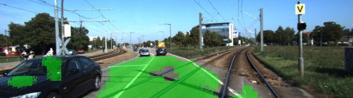
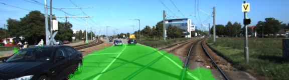
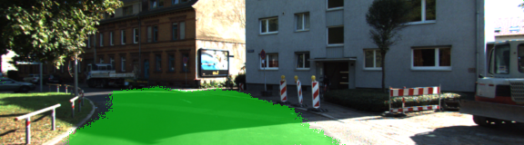
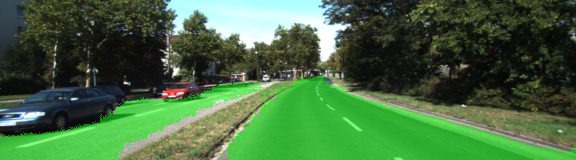
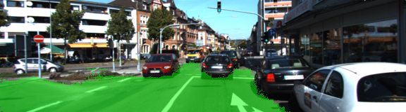

# Semantic Segmentation
### Introduction
In this project, I implemented a Fully Convolutional Network (FCN) using Tensorflow to label the pixels of a road in images. The idea is based on this paper: https://people.eecs.berkeley.edu/~jonlong/long_shelhamer_fcn.pdf.

### Dataset
We use the [Kitti Road dataset](http://www.cvlibs.net/datasets/kitti/eval_road.php) downloaded from [here](http://www.cvlibs.net/download.php?file=data_road.zip). There are 289 labelled images for training and 290 unlabelled imaged for testing. 

Sample training image:

Sample training image label:

### Architecture

I used the pre-trained VGG model ([download link](https://s3-us-west-1.amazonaws.com/udacity-selfdrivingcar/vgg.zip)) for the encoder layers. To make the depth dimension compatible with the final output (2, which is the number of classes: road pixel or non-road pixel), I first used 1x1 filters to convolve the vgg layer output. For vgg layer 3, 4, 7, after the 1x1 convolution, they remain they original width and height, and now with a depth of 2.

Next after scaling up the layers (because they were re-scaled in the VGG model), I upsampled (or transpose convolve) these layers. In convolution, we apply element-wise multiplication on two matrices (the kernel and a patch of the layer output) to get a scalar; the idea of transpose convolution is that instead of element-wise multiplication, we take one element from the layer output, multiply it with each element in the kernel (scalar x matrix multiplication) and add up the overlapping regions.

Another key idea in the original FCN paper is skip connections. To better retain information from the original image and the encoding layers, we directly add up the upsampled layers in the decoding part of the network and the earlier corresponding encoding layers. They have the same dimension.

See implemention in main.py:layers().

The loss function is cross entropy (plus l2 regularization).

### Optimization
A few learnings from the parameter tuning phase:

1. Smaller batch size (I used 4) produces better result.
2. With the convolutional kernels, activation function such as ReLu is not necessary and possibly can make the reuslts worse.
3. Xavier or other intialization for the kernels make a big difference. I used Xavier initializer.
4. Regularization is important: both L2 regularization for each kernel and a 50% dropout rate in training.
5. I obtained the best result with a learning rate of 0.0001 using Adam Optimizer after 25 epochs.

Classification results before optimization:

Classification results after optimization:

### Results

Full final results on the test images can be viewed under the runs directory. Here are a few examples:

### Training Details
Trained on AWS GPU (p2.xlarge instance, 61 GiB Memory), train 25 epochs takes about half an hour. Used tensorflow-gpu 1.3.0.
